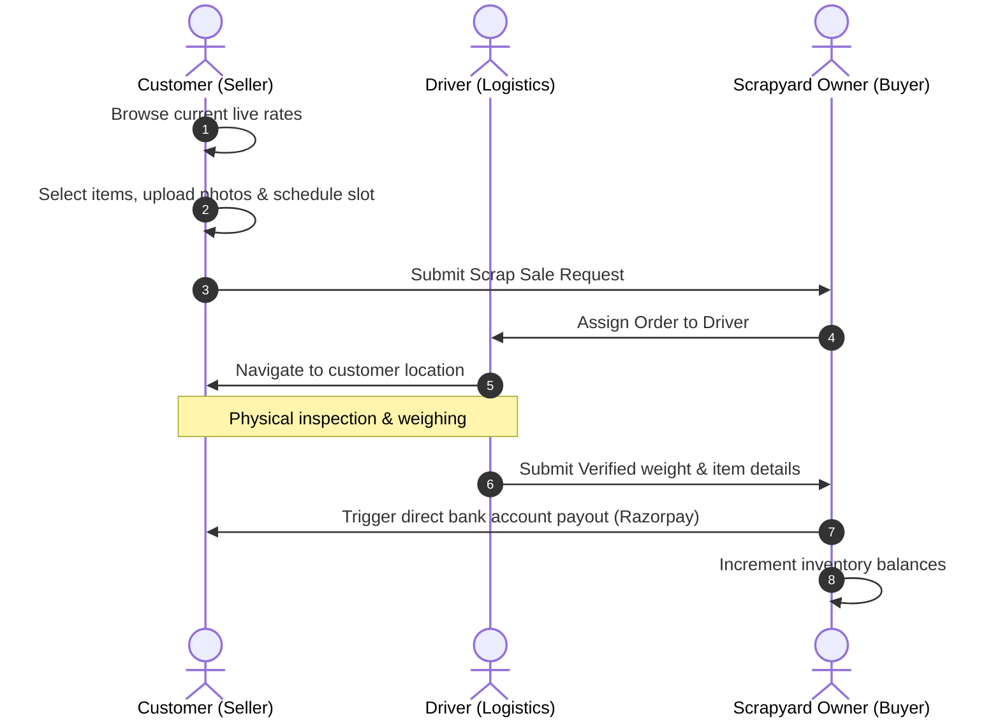
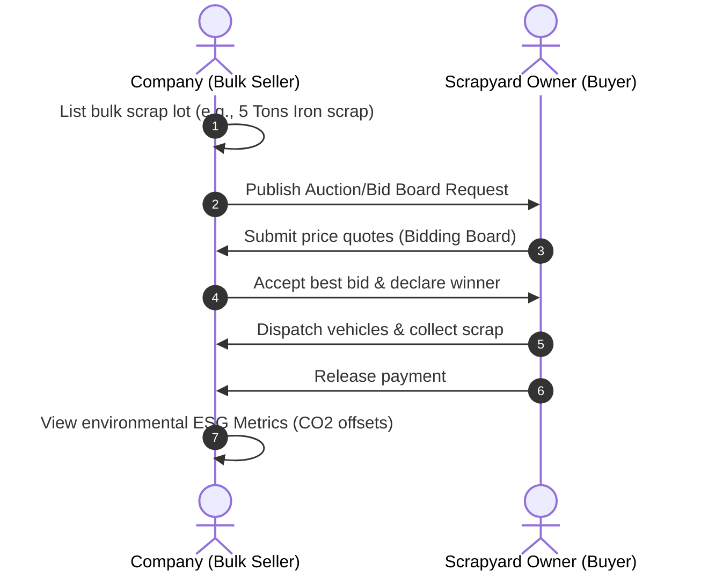

# ♻️ ScrapSavvy - Tech-Enabled Scrap Pickup & Recycling Platform

ScrapSavvy is an online, eco-friendly scrap collection, recycling management, and upcycled product marketplace. It bridges the gap between individual households (customers), bulk scrap producers (companies), drivers (logistics), and recycling facilities (scrapyards) to promote sustainable waste management and track ESG benefits.

<p align="center">
  
</p>

---

## 🛠️ Technology Stack

### 🎨 Frontend
*   **Core UI Engine**: React.js (v18.3.1)
*   **State Management**: Redux Toolkit (v2.11.2) & React Redux
*   **Routing**: React Router DOM (v6.26.0)
*   **Styling & Components**: Material UI (v5.16.6), Emotion, FontAwesome, React Icons
*   **Real-time Feed**: SockJS Client & STOMP JS (WebSockets)
*   **Data Plots & Charts**: Chart.js & React Chartjs 2
*   **Animations**: Framer Motion & Swiper
*   **Utilities**: Axios, SweetAlert2, React Toastify, jsPDF, jspdf-autotable

### ⚙️ Backend (Spring Boot REST API)
*   **Language & Runtime**: Java 17
*   **Framework**: Spring Boot (v3.2.5) with Web, WebSockets, Security, and Data JPA
*   **Database**: MySQL
*   **Security**: JWT Token Authentication (JJWT v0.11.5)
*   **Integrations**:
    *   **Razorpay SDK**: Fast and secure digital payouts.
    *   **Google Gemini API**: Dynamic AI virtual chat assistant.
*   **Docs & Tools**: Swagger/OpenAPI UI, Project Lombok, Dotenv config.

---

## 👥 Platform Roles & Workflows

### 1. User Roles
*   **Individual Customer**: Browse rates, book/schedule standard pickups, chat with AI, shop upcycled products.
*   **Bulk Company**: Sell bulk warehouse/industrial waste, bid on scrap lots, track green ESG metrics (CO2 offsets).
*   **Scrapyard Owner**: View pending requests, update rate cards, assign drivers, verify collection weights, and process instant bank payouts.
*   **Driver**: Navigate to pickup locations, physically verify/weigh scrap, and update tracking stages (*Dispatched ➡️ Collected*).

### 2. Main Workflows

#### Customer to Scrapyard Flow


#### Company to Scrapyard Flow (Bidding & ESG)


---

## 🚀 Getting Started

### Prerequisites
*   Node.js (v18+)
*   npm (v9+)

### Installation
1. Clone the repository:
   ```bash
   git clone https://github.com/Sudarshanhingalje/ScrapSavvy-frontend.git
   cd ScrapSavvy-frontend
   ```

2. Install dependencies:
   ```bash
   npm install
   ```

3. Create a `.env` file in the root directory and add your backend API URL:
   ```env
   REACT_APP_API_URL=http://localhost:8080
   ```

4. Launch the local development server:
   ```bash
   npm start
   ```
   Open [http://localhost:3000](http://localhost:3000) to view it in your browser.

---

## 📂 Folder Structure Overview

```text
src/
├── app/               # Redux store config and root reducer
├── assets/            # Static assets (images, logos, videos)
├── config/            # App environments and API configurations
├── context/           # React context providers (e.g., CartContext)
├── features/          # Feature modules (AI assistant, Auth, Company, Customer)
│   ├── ai-assistant/  # AI Chat panel and wave animations
│   ├── auth/          # Authentication pages (Login, Signin, Reset)
│   ├── company/       # Company bids, contracts, ESG tracking, and dashboards
│   └── customer/      # Customer pickup forms, dashboard, cart, and reviews
├── Static/            # Sidebar, Splash screens, and global css files
├── App.js             # Root component and main router configuration
└── index.js           # Entry point
```
